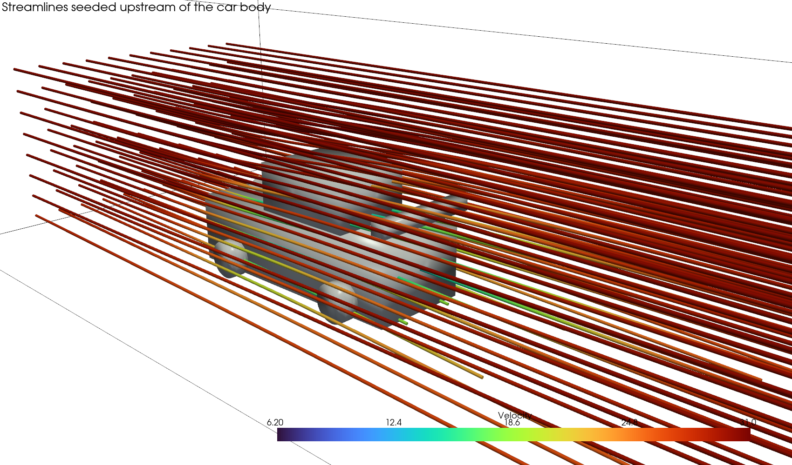
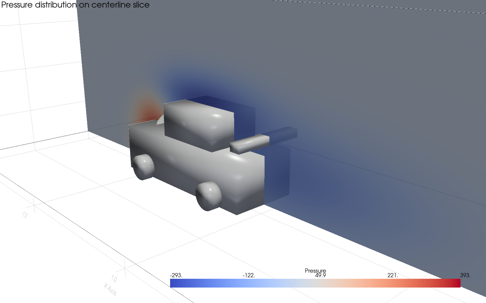
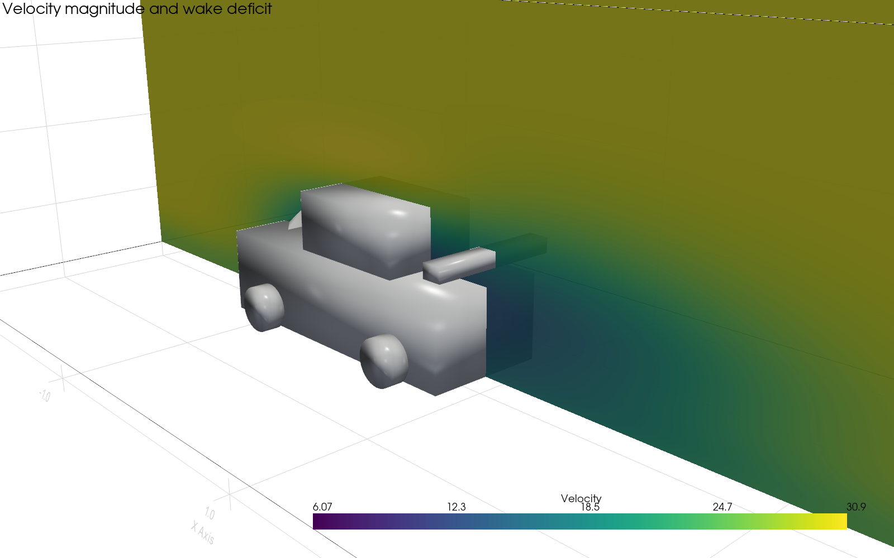
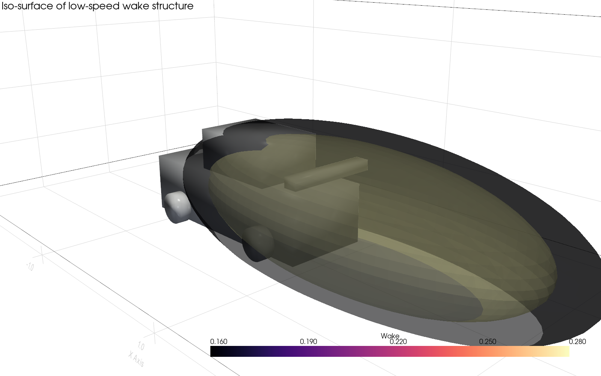
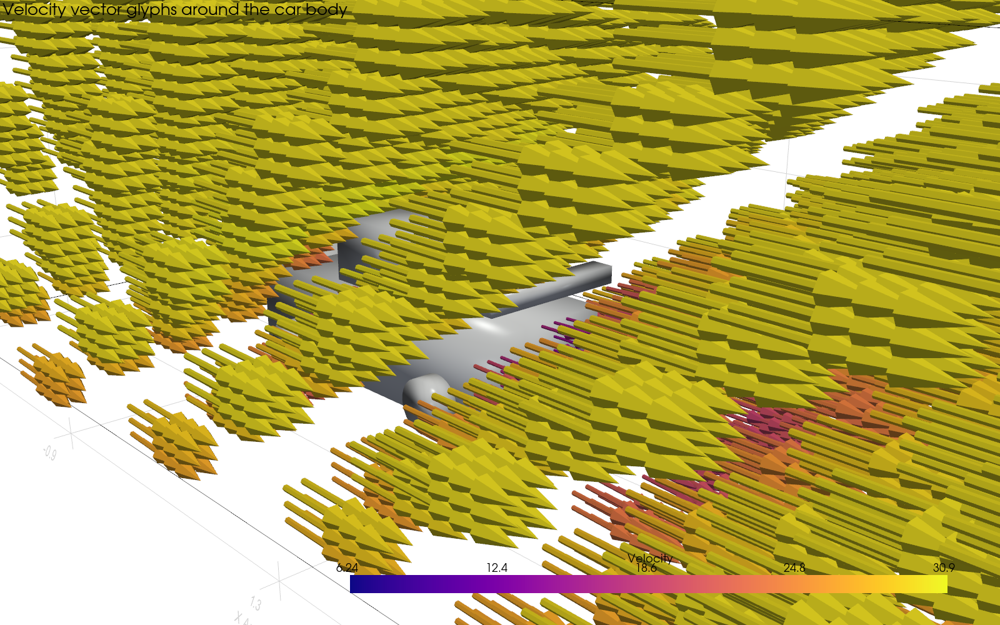
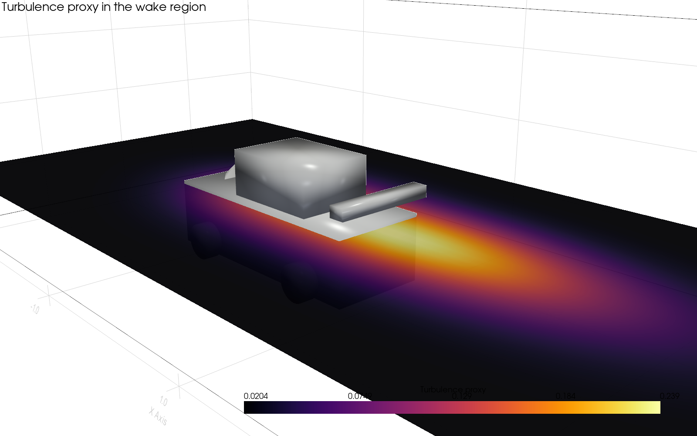
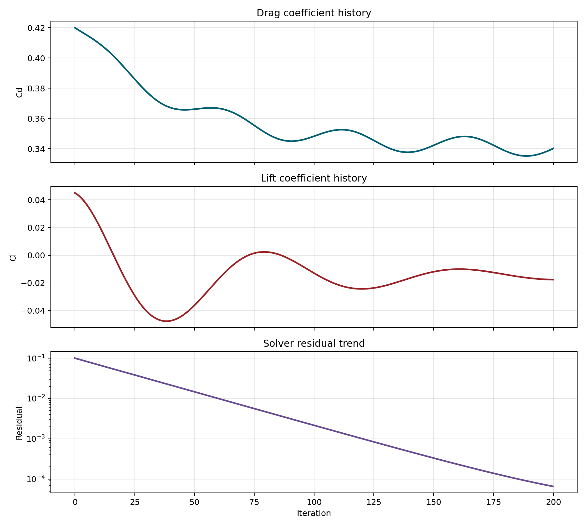
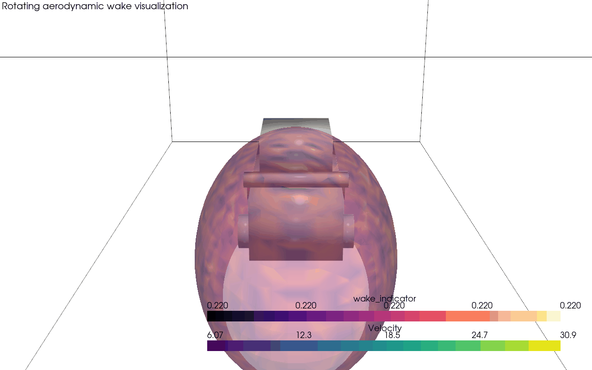

# CFD Car Aerodynamics Visualization Pipeline using ParaView

An exploratory scientific visualization and CFD project using ParaView, OpenFOAM workflows, Python, VTK, PyVista, NumPy, and Matplotlib.

This repository is designed for beginner-to-intermediate scientific visualization practice. It creates a portable car-aerodynamics-style flow dataset, exports pressure and velocity visualizations, renders streamlines and wake iso-surfaces, generates animations, and documents how the same workflow connects to OpenFOAM tutorial cases such as `motorBike` and public Ahmed-body datasets.

## Project Goal

The project demonstrates a realistic visualization workflow used in CFD engineering:

- Generate or load CFD-style velocity and pressure fields.
- Inspect scalar fields such as pressure, turbulence, vorticity, and wake intensity.
- Inspect vector fields through glyphs and streamlines.
- Create presentation-quality scientific screenshots.
- Create rotating camera animations for presentations and GitHub demos.
- Explain aerodynamic drag, lift, wake formation, pressure distribution, and turbulence in beginner-friendly language.

This is not presented as a new CFD solver or new aerodynamic algorithm. It is a reproducible visualization pipeline for learning, demonstration, and technical communication.

## Quickstart

```bash
cd paraview-car-aerodynamics
bash setup.sh
source .venv/bin/activate

python scripts/setup_case.py
python scripts/export_visuals.py --input data/processed/sample_car_flow.vtu
python scripts/create_streamlines.py --input data/processed/sample_car_flow.vtu
python scripts/generate_animation.py --input data/processed/sample_car_flow.vtu --format gif
python scripts/metrics_analysis.py --input data/processed/metrics.csv
```

Outputs are written to:

- `data/processed/` for VTK datasets and CSV metrics
- `screenshots/` for still scientific renderings
- `animations/` for GIF/MP4 camera animations

## Example Visual Gallery

| View | File |
| --- | --- |
| Streamlines |  |
| Pressure contour |  |
| Velocity wake |  |
| Wake iso-surface |  |
| Vector glyphs |  |
| Turbulence proxy |  |
| Drag/lift metrics |  |

Animation:



## Tools Used

- **ParaView** for interactive scientific visualization, filtering, color maps, streamlines, slices, contours, and animations.
- **OpenFOAM** for CFD simulation workflows and tutorial cases such as `motorBike`.
- **Python 3.11+** for automation.
- **VTK/PyVista** for scripted scientific visualization.
- **NumPy/Pandas/Matplotlib** for field generation and metric analysis.
- **Docker** as the recommended macOS-friendly OpenFOAM path.

## Dataset Strategy

This repo supports three levels of data:

1. **Portable sample case**: generated by `scripts/setup_case.py`; runs on a normal laptop without OpenFOAM.
2. **OpenFOAM motorBike tutorial**: a standard beginner aerodynamic case for learning mesh, solver, timesteps, boundary conditions, and ParaView post-processing.
3. **AhmedML dataset**: public high-fidelity Ahmed-body CFD data for advanced study. The Ahmed body is a simplified car-like bluff body used to study separation, wakes, pressure drag, and vehicle aerodynamics.

AhmedML reference: https://caemldatasets.org/ahmedml/

## Scientific Interpretation

The pressure slice highlights high pressure near the front stagnation region and lower pressure over accelerated roof flow and behind the body. The velocity view shows a wake deficit downstream, where separated flow has lower speed and higher turbulence. Streamlines help reveal how air is deflected around the car and how recirculation forms behind the rear surface. Iso-surfaces make the wake volume visible in 3D.

## OpenFOAM and ParaView Workflow

The recommended beginner path is:

1. Run the portable Python workflow.
2. Install ParaView and open the generated `.vts` or `.vtk` files.
3. Learn filters: Slice, Contour, Glyph, Stream Tracer, Calculator, and Clip.
4. Install OpenFOAM with Docker on macOS.
5. Run the `motorBike` tutorial.
6. Open the resulting `.foam` case in ParaView.
7. Recreate the same screenshots and animations with real OpenFOAM output.

Detailed guides:

- [Installation](docs/installation.md)
- [Workflow](docs/workflow.md)
- [ParaView Guide](docs/paraview_guide.md)
- [Aerodynamic Theory](docs/aerodynamic_theory.md)

## Project Structure

```text
paraview-car-aerodynamics/
├── scripts/       # Python automation for VTK data, visuals, animations, metrics
├── docs/          # Beginner CFD, ParaView, OpenFOAM, and workflow guides
├── notebooks/     # Jupyter walkthroughs
├── career/        # LinkedIn, resume, and recruiter-facing summaries
├── data/          # Raw, processed, and sample case data
├── screenshots/   # Generated still renderings
└── animations/    # Generated GIF/MP4 animations
```

## Learning Outcomes

By completing this project, you can honestly say you practiced:

- Loading and exporting VTK-style scientific datasets.
- Creating scalar and vector field visualizations.
- Building streamlines, slices, contours, glyphs, and iso-surfaces.
- Automating scientific rendering with Python.
- Understanding the role of OpenFOAM and ParaView in CFD post-processing.
- Explaining pressure drag, wake formation, turbulence, and aerodynamic interpretation.

## Future Improvements

- Add ParaView state files after generating final screenshots.
- Add a Streamlit or PyVista web dashboard.
- Run and document a full OpenFOAM `motorBike` case.
- Add selected AhmedML samples for high-fidelity comparison.
- Add quantitative drag/lift extraction from OpenFOAM force coefficient files.
